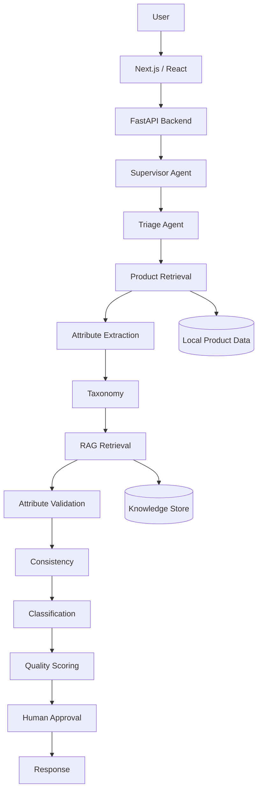

# Retail Product Attribute Quality Classification

## Project overview
This project is a local, runnable multi-agent retail data-quality platform for evaluating product attribute quality in an e-commerce catalog. It combines a FastAPI backend, a typed LangGraph workflow, synthetic product data, a retrieval layer, and a Next.js dashboard to demonstrate how AI agents can assess product records, classify attribute quality, gather evidence, and support human approval before catalog changes.

## Business problem
Retail teams often manage large catalogs where attributes are missing, conflicting, duplicated, or inconsistent with product documentation. Poor attribute quality impacts search, filtering, SEO, recommendation quality, and downstream analytics. This application is designed to analyze product records, identify evidence-backed issues, and support approval before any consequential quality change is applied.

## Objectives
- Detect missing, invalid, inconsistent, or suspicious attributes
- Validate product attributes against taxonomy and known documentation
- Use a modular multi-agent workflow instead of a single prompt
- Maintain grounded findings with evidence and citations
- Support human approval for high-impact recommendations
- Provide a local backend and dashboard for demonstration and iteration

## Feature summary
- FastAPI backend and health/analysis endpoints
- Typed LangGraph-style workflow state
- Product retrieval and attribute extraction modules
- Category rules and taxonomy validation
- RAG-inspired document retrieval and chunking pipeline
- Quality scoring and recommendation logic
- Human approval workflow for consequential changes
- Structured local data and synthetic products
- Frontend dashboard for search and workflow visibility
- Evaluation script and automated tests

## Architecture


## Multi-agent structure
- Supervisor agent: coordinates the workflow
- Triage agent: identifies product and route
- Product retrieval agent: loads product data
- Attribute extraction agent: extracts structured attributes
- Taxonomy agent: validates category and required fields
- Retrieval agent: searches local knowledge documents
- Validation agent: checks format and category consistency
- Consistency agent: detects conflicting values
- Classification agent: applies quality labels
- Scoring agent: calculates overall quality
- Recommendation and action agents: prepare and track corrections
- Response agent: summarizes final findings

## Technology stack
- Python
- FastAPI
- Pydantic
- LangGraph
- Chroma-style vector store abstraction
- OpenAI-compatible LLM integration
- Next.js + TypeScript + Tailwind
- PostgreSQL-ready configuration
- Redis-ready configuration
- Pytest

## RAG pipeline

```mermaid
flowchart LR
    DOC[Documents]
    LOADER[Loader]
    CLEAN[Cleaning]
    CHUNK[Chunking]
    META[Metadata]
    EMBED[Embedding]
    VECTOR[Vector Store]
    RETRIEVE[Retriever]
    RERANK[Reranker]
    CONTEXT[Context Builder]
    LLM[LLM]
    CITE[Citations]

    DOC --> LOADER --> CLEAN --> CHUNK --> META --> EMBED --> VECTOR --> RETRIEVE --> RERANK --> CONTEXT --> LLM --> CITE
```


## Data model
The project uses synthetic, local product examples stored under [data/products/products.json](data/products/products.json) and taxonomy guidance under [data/taxonomy/category_rules.json](data/taxonomy/category_rules.json). The knowledge base is stored under [data/knowledge_base](data/knowledge_base).

## Quality classification categories
- VALID
- INVALID
- MISSING
- INCONSISTENT
- SUSPICIOUS
- AMBIGUOUS
- NOT_APPLICABLE
- NEEDS_HUMAN_REVIEW

## Quality scoring
The scoring logic is implemented in [backend/app/services/quality_service.py](backend/app/services/quality_service.py). It calculates a product-level score from attribute-level classifications using deterministic weights and produces review-required flags when scores fall below acceptable thresholds.

## Folder structure
- [backend/app](backend/app)
- [frontend/app](frontend/app)
- [data](data)
- [scripts](scripts)
- [tests](tests)
- [evaluation](evaluation)
- [docker-compose.yml](docker-compose.yml)
- [Dockerfile](Dockerfile)
- [.env.example](.env.example)

## Installation
```bash
git clone <repository>
cd retail-product-attribute-quality
python -m venv .venv
source .venv/bin/activate
pip install -r requirements.txt
```

## Environment variables
Copy [.env.example](.env.example) to a local .env file and set values for your environment.

```bash
cp .env.example .env
```

Required variables:
- OPENAI_API_KEY
- OPENAI_MODEL
- OPENAI_EMBEDDING_MODEL
- DATABASE_URL
- REDIS_URL
- CHROMA_PERSIST_DIRECTORY
- NEXT_PUBLIC_API_URL

## Running locally
### Backend
```bash
source .venv/bin/activate
uvicorn backend.app.api.main:app --host 0.0.0.0 --port 8000 --reload
```

### Frontend
```bash
cd frontend
npm install
npm run dev
```

### Docker
```bash
docker compose up --build
```

## Database initialization
The project is designed to work with PostgreSQL-ready configuration and a local SQLite fallback. For the demo setup, no migration step is required; product data is loaded from local JSON and the backend uses the product service layer.

## Synthetic data generation
```bash
source .venv/bin/activate
python scripts/seed_database.py
```

## RAG ingestion
```bash
source .venv/bin/activate
python scripts/ingest_documents.py
```

## Running tests
```bash
source .venv/bin/activate
pytest -q
```

## Evaluation
```bash
source .venv/bin/activate
python scripts/run_evaluation.py
```

## Bulk classification
This project includes a basic batch-oriented pattern for classification; the local API currently serves product-level classification and quality scoring. For a production implementation you would extend the backend to accept CSV/JSON and queue work with concurrency controls.

## Sample API requests
```bash
curl http://localhost:8000/api/health
curl http://localhost:8000/api/products/P1001
curl -X POST http://localhost:8000/api/products/analyze -H 'Content-Type: application/json' -d '{"product_id":"P1001","user_query":"Analyze product quality"}'
```

## Security
- Keep secrets in environment variables
- Never expose API keys in browser code
- Treat product documents as untrusted content
- Use explicit tool calls for consequential actions
- Require human approval before high-impact catalog changes

## Limitations
- This repository contains a working local demonstration, not a production-grade multi-tenant SaaS deployment.
- The LLM integration is configurable but intentionally safe and local-demo friendly when an API key is not provided.
- Database persistence and vector storage are intentionally lightweight to keep local execution simple.

## Future enhancements
- Replace JSON fallback with PostgreSQL models and migrations
- Add full ChromaDB integration and metadata filtering
- Extend the frontend with real workflow state and approvals
- Add bulk CSV processing and export flows
- Add richer evaluation metrics and dashboards

## Verified local status
The project was verified in this workspace with:
- `pytest -q` → 2 passed
- backend API health endpoint → 200 OK
- frontend production build → successful Next.js build

## Project references
- [backend/app/api/main.py](backend/app/api/main.py)
- [backend/app/graph/workflow.py](backend/app/graph/workflow.py)
- [backend/app/services/product_service.py](backend/app/services/product_service.py)
- [backend/app/services/quality_service.py](backend/app/services/quality_service.py)
- [frontend/app/page.tsx](frontend/app/page.tsx)
- [data/products/products.json](data/products/products.json)
